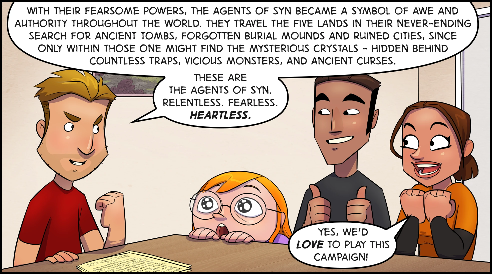
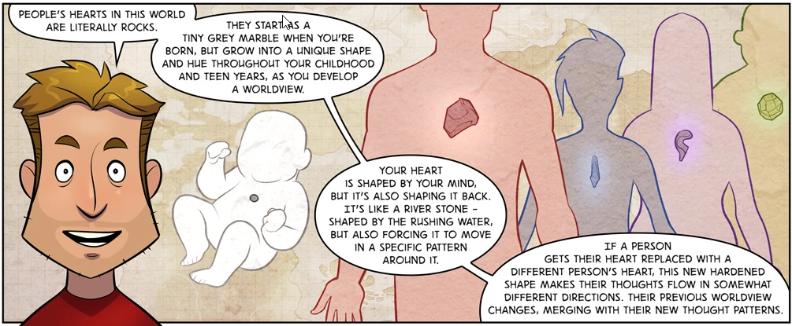
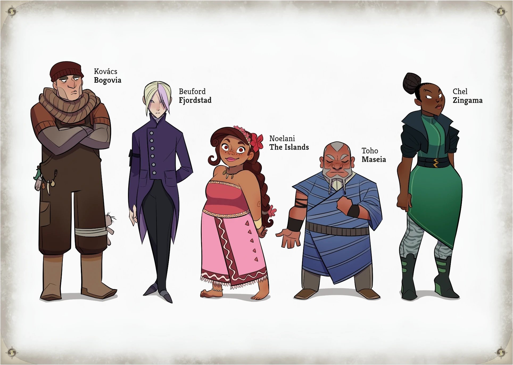
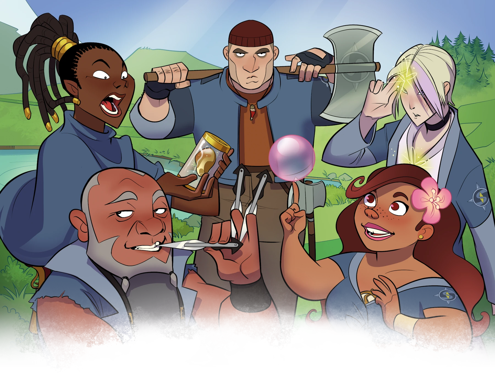

# Crystal Heart Starter Set
Syn is looking for Crystal Hunters!
**Willing to replace your HEART with a CRYSTAL that gives you SUPERPOWERS?¹**
*(¹Said Crystal also influences your personality in semi-predictable ways.)*

**Interested in touring all over the Five Lands in search of UNDISCOVERED Crystals, and recover them for Syn?²**
*(²Discovery of, and interaction with, Crystal-tainted creatures and Shard-holding antagonists included in the deal.)*

  

  

## Want to roll some DICE?
Inspired by anime and superhero comics, the Crystal Heart roleplaying setting for Savage Worlds was developed in the webcomic Up to Four Players as the characters were playing it. Now you too can become a Syn Agent, explore ancient locations and hunt down powerful Crystals! Replace your heart with a Crystal and gain superpowers! (also lose your mind; but just a little).

Suitable for everyone, from first-time players to savvy Game Master of many years!
The Starter Set includes:
- Introduction to the world and rules of Crystal Heart
- Five ready-made Agent characters
- Starter adventure
- A summary sheet for the Crystal rules
- Two-page comics explaining how to play Savage Worlds

  

# Conversion
This module is a conversion from [Crystal Heart Starter Set](https://www.drivethrurpg.com/product/254714). You can get the original at: 
[Crystal Heart Starter Set](https://www.drivethrurpg.com/product/254714)

# Complete Module!
If you liked Crystal Heart Starter Set you can have the full module with everything from the core book! Click the image to watch the module preview on [Youtube](https://youtu.be/EX-YaEYc5Bk):

# LICENSE
Crystal Heart, all unique characters, creatures, and locations, artwork and logos belong to Up to Four Players, Eran Aviram and Aviv Or. The artwork provided in this module is for personal use only with the Foundry Virtual Tabletop Software.